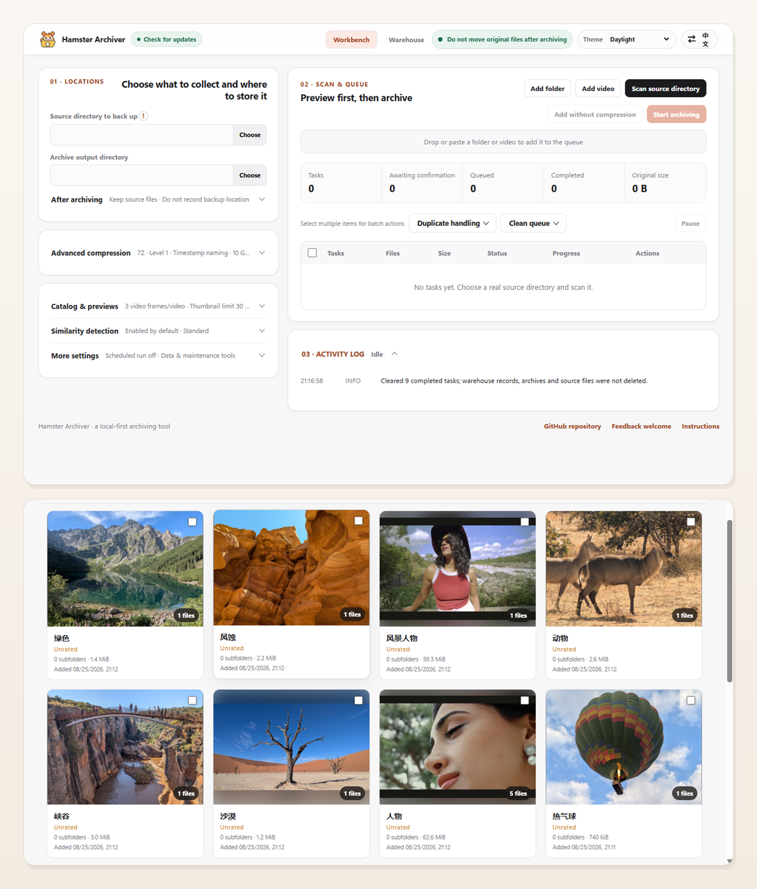
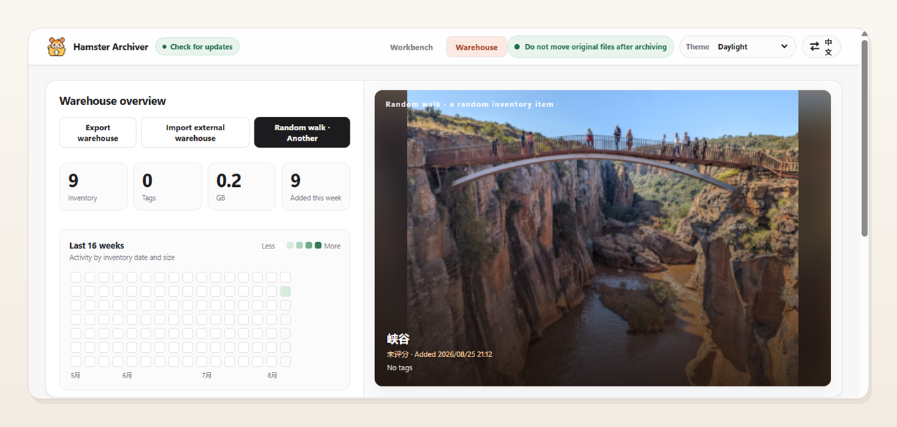
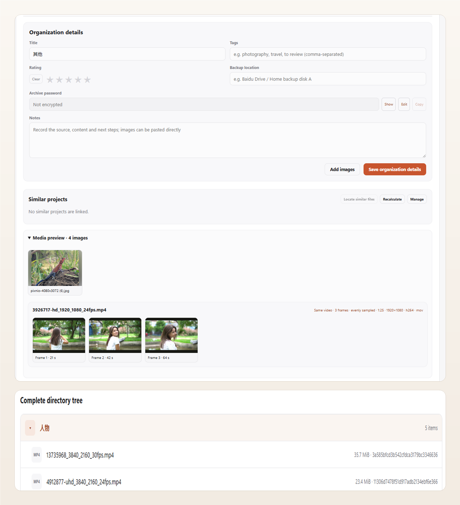

<div align="center">


# Hamster Archiver 仓鼠症大结局

### Turn scattered large files into verified archives and a searchable, previewable local warehouse

Local-first batch archiver and searchable media vault for Windows.

Local-first · Batch archiving · Media previews · Portable data


[](https://github.com/CarlosZ16420/hamster-archiver/actions/workflows/ci.yml)

[Download a release](../../releases) · [简体中文](README.md) · [English](README.en.md) · [Report an issue](../../issues) · [Contribute](CONTRIBUTING.md)

</div>

---

## What kind of tool is this?

Hamster Archiver is made for you if any of these sound familiar:

- 📁 Your Downloads folder contains several terabytes of videos and images, and **finding anything feels like archaeology**.
- 🔁 You download the same resource three times before remembering that **you may already have saved it**.
- 🗂 You want to organize everything, but **give up as soon as you open the folder**.
- 😰 You back files up to cloud storage, but the uploads are so disorganized that **you cannot find them again**.
- 🔒 You do not want to hand private media to **a cloud photo service's AI scanner**.

## What it does

Hamster Archiver first scans folders and videos into a queue, then lets you choose compressed or uncompressed intake before verification and registration in a searchable local warehouse. A normal compression tool only creates archives; Hamster Archiver also tells you **what is inside, where it is stored and whether you have already archived something similar**.

- Quickly turn selected folders into a visual warehouse.

  <p align="center">
    
  </p>

- Preserve an honest overview of your collection.

  <p align="center">
    
  </p>

  The warehouse is more than a list of archive files. It provides cover browsing, activity statistics and random discovery. Search covers titles, tags, notes, paths and filenames.

- Record project details accurately.

  <p align="center">
    
  </p>

  Each project contains thumbnails from images and videos as well as the complete directory structure. Every preview is stored as a thumbnail so the warehouse preserves useful context without growing unnecessarily large.

- Customize compression parameters, sampled video frames, per-project thumbnail limits and other settings.
- Name similarity is a non-blocking candidate hint. Once the queue starts, complete content fingerprints can auto-skip exact duplicates according to your setting, while genuine similarity needs only one review.
- Pause for human confirmation when an unusually large task or abnormal compression ratio is detected.
- Keep, move or recycle original files only after compression, integrity verification and warehouse registration all succeed.

## Core capabilities

### Safe archiving

- Bundled portable 7-Zip supports 7z/ZIP, compression levels 0–9 and full `7z t` integrity tests.
- A pre-compression manifest and source recheck protect the input; unreadable files are skipped and recorded in the log.
- Abnormal compression results do not enter the warehouse automatically. You can keep the result or delete only the abnormal output.
- Multi-volume outputs use an isolated staging and atomic deletion flow, avoiding partial handling of a volume set.
- Free space is checked before compression. Cross-drive moves copy, verify and only then delete the source.
- The queue supports pause, finish-current-then-pause, scheduled runs and remaining-time estimates based on real history.

### Media and thumbnails

- A portable FFmpeg binary handles video inspection and evenly sampled frames without FFprobe.
- Video frame count and per-project thumbnail limits are configurable; portrait media remains fully visible.
- Multiple frames from the same video stay grouped together.
- Images can be enlarged, selected as the cover or removed, and extra images can be selected or pasted manually.

### Search, duplicates and similarity

- SQLite + FTS5 provides persistent indexes. Chinese search uses character and bigram candidates; Latin text is indexed by word.
- A project fingerprint index narrows candidates before complete relative paths, sizes and MD5 values strictly confirm an exact duplicate. Similarity analysis stays entirely local.
- File-level duplicate evidence uses batched SQLite lookups, and older warehouses backfill project fingerprints automatically instead of repeatedly scanning the whole catalog.
- Similarity can be recalculated for one project, and a relationship can be dismissed manually; dismissals are saved symmetrically.
- The similarity whitelist is editable, and highlighted repeated terms in project details can be added to it with one click.

### Original-file location tracking

- Each project keeps a private original-path field. Older records that do not contain it are safely initialized with an empty value.
- Projects that were not moved show their original location; moved or recycled projects show their current state.
- Project details can open the current source location. Recycled items can be restored to their original location and opened after a successful restore.
- Source handling is checked immediately after the current task. A safety halt occurs only when that task's Recycle Bin result cannot be verified. Historical projects are not sampled in the background, so intentional user cleanup is not misreported as a task failure.
- When deleting a warehouse record, the app can first try to restore a moved or recycled source. If restoration fails, the record and archives are preserved.

### Warehouse organization

- Titles, tags, ratings, notes, backup locations and project-specific extraction passwords.
- Passwords stay masked until explicitly revealed.
- Append tags in bulk, change backup locations in bulk, delete selected records and undo up to ten operations.
- Add inventory records without an archive, export a warehouse or merge an external warehouse.

## Quick start

### Use a release directly

1. Download the Windows x64 ZIP from [Releases](../../releases).
2. Extract the complete package and run `HamsterArchiver.exe`.
3. Optionally set Directory to back up, or click Scan directory and choose it then. Scanning only fills the queue; review any warnings and choose compressed or uncompressed intake explicitly.

Keep the complete release directory. Do not copy only the EXE: Electron, 7-Zip and FFmpeg depend on the complete package. The user data area defaults to the adjacent `userdata` directory and can be safely copied or switched under More settings.

### Manual update when automatic update is unavailable

Update details are shown before replacement and once more when the new version first starts. Background checks remain silent and never force an update.

1. Download the latest Windows x64 ZIP from [Releases](../../releases) without extracting it.
2. In the old app, select Check for updates, choose Manual update and select the new release ZIP.
3. After updating, confirm that the version, warehouse records and thumbnails are correct.

### Move a warehouse

1. Use Export warehouse to create a warehouse ZIP.
2. Run `HamsterArchiver.exe` in the new directory, open Warehouse, choose Import external warehouse and select the exported ZIP.

### Run from source

Requirements: Windows; Node.js 22.12+ on the 22.x line or Node.js 24.x; and npm 10.x/11.x. `.nvmrc` and CI follow Node.js 24.x as a development recommendation, not a Git or build gate. Direct npm dependencies use exact versions; run `npm ci` for the first installation.

`npm run release:local` uses the currently supported local Node.js installation. It does not download another Node runtime or reject a supported patch version; the release manifest records the actual Node.js and npm versions used.

```powershell
git clone https://github.com/CarlosZ16420/hamster-archiver.git
cd hamster-archiver
npm ci
npm run verify:dependencies
npm run check
npm test
npm start
```

Maintainer builds, user data and the public snapshot live in the repository-external `HamsterArchiver-Local/` directory. Development uses isolated `data/development`; launch the current maintained build with `npm run preview:current`. See the [development guide](docs/DEVELOPMENT.md) and [release process](docs/RELEASE.md).

The source repository does not commit the large `ffmpeg.exe`. `dependency-lock.json` pins Electron, 7-Zip 26.02 and FFmpeg versions, sources, source packages and critical binary SHA-256 values. Licenses and source notices must exist and are included in the release integrity manifest with critical programs. Run `npm run tools:prepare` to restore bundled tools from the locked URLs and hashes, and run `npm run verify:tools` before a release build. Release packaging checks the versions and copied files again and records critical SHA-256 values in `release-manifest.json` for startup and update verification.

## Portable data layout

```text
HamsterArchiver-v4.5.16-win-x64/
├─ HamsterArchiver.exe
├─ tools/
│  ├─ 7zip/
│  └─ ffmpeg/
├─ resources/
└─ userdata/
   ├─ config/       # settings and similarity whitelist
   ├─ warehouse/    # SQLite warehouse and thumbnails
   ├─ logs/         # current-user runtime log
   ├─ processed/    # default destination for processed sources
   └─ electron/     # local interface cache
```

Compression staging is created beside the archive-output directory by default, for example `D:\packed-staging`, to reduce cross-drive moves. The source and archive-output locations are selected by the user and are not part of the source repository or user database.

The user data area can contain passwords, paths, thumbnails and warehouse indexes. Git ignores it and it never enters the public snapshot. When More settings switches the location, an empty target is populated by copying the data while the old directory is retained; a target that already contains data is never merged silently with the current warehouse.

## Technology and boundaries

| Area | Implementation |
|---|---|
| Desktop | Electron 43, context isolation, sandbox, strict CSP |
| Data | Node built-in SQLite, WAL, transactions, FTS5 |
| Compression | Portable 7-Zip, 7z/ZIP, configurable 64 MiB–10 GiB volumes, optional passwords, integrity tests |
| Media | One FFmpeg program for inspection and sampled frames |
| Performance | Warehouse pagination, virtualized directory trees, persistent search and similarity candidate indexes |
| Privacy | User data stays on the local machine; warehouse data, media and passwords are not uploaded |

The app does not upload files. It contacts GitHub only when you select Check for updates or open a GitHub link. Update packages are downloaded to a temporary area under `userdata`, verified and then applied by an independent update helper. Uploading archives remains the responsibility of your cloud-storage client or manual workflow.

## Development and contribution

Before submitting changes, run:

```powershell
npm run verify:dependencies
npm run check
npm test
npm run publish:check
```

Also run `npm run verify:tools` before a formal build. Dependency or bundled-tool upgrades must update `dependency-lock.json` separately, review the lock-file diff and complete real archive and media-frame acceptance checks.

Never commit `userdata/`, databases, logs, archives, passwords, real media or personal absolute paths. See [CONTRIBUTING.md](CONTRIBUTING.md) and [SECURITY.md](SECURITY.md).

This project is released under the [MIT License](LICENSE). Bundled 7-Zip and FFmpeg retain their accompanying licenses.

---

<div align="center">

Try the app, open an Issue or submit a Pull Request. Your feedback helps make this small tool safer and easier to use.

[GitHub repository](https://github.com/CarlosZ16420/hamster-archiver) · [Feedback welcome](https://github.com/CarlosZ16420/hamster-archiver/issues)

</div>

## Acknowledgements

- LINUX DO
