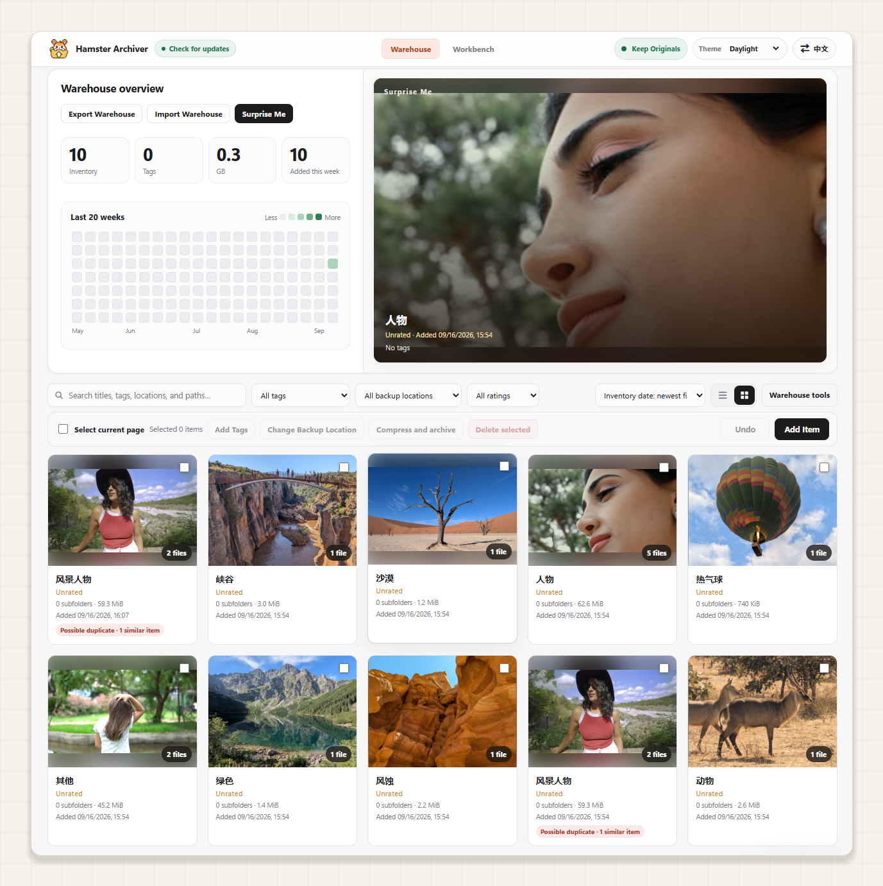
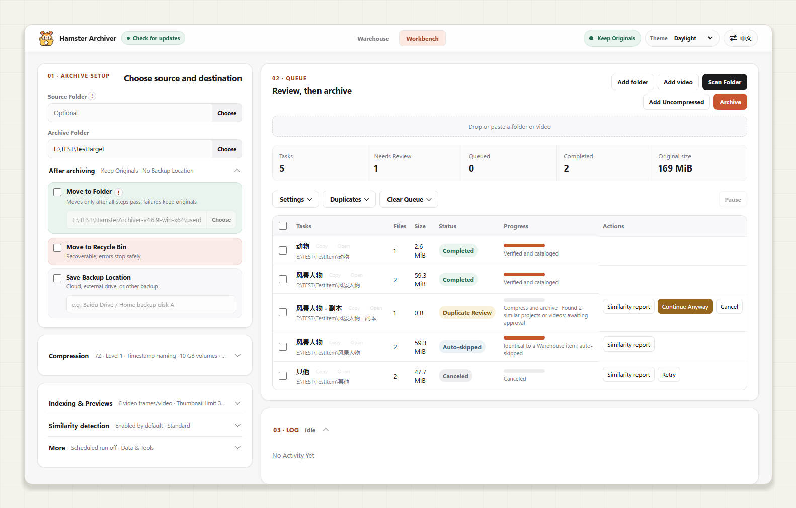
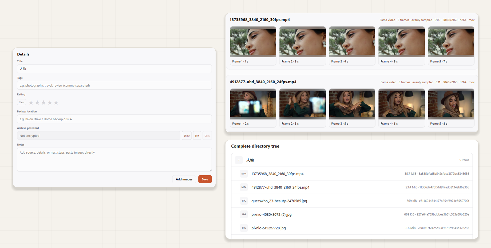

# Hamster Archiver 仓鼠症大结局

### Enjoy collecting. Enjoy organizing, too.

Windows local-first file organizer, media catalog and verified batch archiver with MCP tools for AI assistants.

**[Download for Windows](https://github.com/CarlosZ16420/hamster-archiver/releases/latest)** · **[Use with AI](docs/AI-QUICKSTART.md)** · [简体中文](README.md) · [Report an issue](https://github.com/CarlosZ16420/hamster-archiver/issues)

[Quick start](#quick-start) · [Use with AI](#let-ai-organize-it-for-you) · [Features](#everyday-ease-supported-by-careful-details) · [FAQ](#frequently-asked-questions) · [Documentation and contributions](#documentation-and-contributions)

Downloads keep piling up, your drive is almost full, and organizing everything never gets done?

- Folders are scattered everywhere. You do not know how to categorize them or what you can afford to delete.
- You want a cloud backup but would rather not upload original pictures and videos for online viewing and processing.
- You plan to package files before uploading, but worry about ending up with archives whose contents you cannot recognize.

**Start by adding one folder.** Hamster Archiver builds a local library of folders and videos with covers, previews and directory manifests. Organize your collection with tags, ratings and notes. When you need a backup, create archives in batches, with optional passwords and split volumes, ready for you to upload or store on another drive.

**Your files can live elsewhere while a clear record of their contents and backup locations stays on your computer.**

Actual application views; some labels in these screenshots may differ from the current version.

## One library, two ways to organize

| Your goal | What you get |
| --- | --- |
| **Organize the files already on your computer** | Originals stay in place while the app creates previews and manifests. Categorize with tags and notes in the library, and queue those records for compression later if needed. |
| **Prepare backups for cloud storage or another drive** | Batch compression, integrity verification and catalog registration. Record the backup location; local covers, video frames and directory trees show what each archive contains. |

The app packages files and records them; you or your sync tool handles cloud uploads. Local organization uses catalog metadata such as tags and does not automatically rearrange folders on disk.

## Quick start

For **Windows x64**, with English and Chinese interfaces. To use the app, choose a [Release package](https://github.com/CarlosZ16420/hamster-archiver/releases/latest); GitHub Source code downloads and repository clones are for development.

1. Download the **Setup EXE installer**, or extract the entire **portable ZIP** and run `HamsterArchiver.exe`.
2. In the archive workbench, scan a directory or drop folders and videos, then review the pending resources. Try one small folder for your first run.
3. For **local organization**, choose uncompressed intake. To **prepare backups**, set the archive output directory and start compressed intake. Open the library afterward to browse and organize the results.

Keep the full portable directory, such as `HamsterArchiver-v4.6.11-win-x64/`; do not copy only the EXE. Compression and video-preview tools are included, and no separate Node.js installation is needed.

## Let AI organize it for you

An AI assistant with local command execution or local MCP access on the target Windows computer can search your collection, add tags, submit intake tasks and track results. A chat assistant with web search alone can provide instructions but cannot access your local files. The project exposes tools for AI assistants; it does not bundle an online content-recognition model.

Send this to an assistant with local access, replacing the folder with your own:

> Please use Hamster Archiver (https://github.com/CarlosZ16420/hamster-archiver) to catalog D:\Downloads\Sample Project without compression, keeping the originals. First read the project's AI quick start and reuse an existing installation; if installation is needed, download and verify a Windows release package. Follow the workflow supported by the installed package, complete read-only connection checks, then perform the task and verify its final result.

**Versions and capabilities:** Downloads and current source may be at different stages. `Unreleased` in the [changelog](CHANGELOG.md) means changes have not been released. Startup diagnostics, intake planning and tray task access depend on what the installed package actually provides.

The AI should first read the package's `ai-capabilities.json`: run `doctor` only when `schemaVersion` is `2` and `cliCommands` includes it. For older packages without that declaration, follow their bundled or versioned `docs/MCP.md`; do not probe with unknown commands. See the [AI quick start](docs/AI-QUICKSTART.md) for configuration, examples and troubleshooting.

After connecting, the AI determines the intake mode, reusing an explicit choice in your request. Inventory-only intake always keeps originals and needs no archive destination or password. Compressed intake reuses saved preferences and asks only for a missing destination and source-handling choice; a password is always optional. Builds supporting intake planning check the scope before submission and track submitted tasks to a final state.

On builds with tray task access, open the workbench at any time to view tasks marked “AI request.” Results should include successful, skipped and failed counts, library records and archive locations. The app itself does not upload media; returned titles, paths and other metadata enter your chosen AI client's context.

## Store the backup elsewhere. Keep its contents in view.

Each project retains image thumbnails, sampled video frames and a complete directory tree. Choose a cover, record the extraction password and backup location, and browse what you archived without opening the archive itself.

## Everyday ease, supported by careful details

### File safety: verify before handling originals

Archive intake follows **manifest → compression → integrity verification → catalog registration → configured source handling**. Low disk space and abnormal output sizes stop processing or require review. Source post-processing runs only after verification and registration succeed.

Details: file preservation and recovery

- Generate a manifest and recheck sources before compression. Cross-drive moves copy and verify before handling the source location.
- Verify archive identity before moving or cleaning up, protecting against replacement files with the same name; handle split archives as a complete set.
- Preserve generated archives for recovery if catalog registration fails. Cancellation during thumbnail generation keeps originals and cleans uncommitted outputs.
- Distinguish a failed source operation from a completed operation whose status could not be saved, retaining diagnostic recovery information.
- Track original-file location and disposition, with restoration of moved or recycled sources when conditions permit.
- Report invalid data locations explicitly; safe data-location switching retains the previous directory instead of silently presenting an empty library.

### Organization: preview, categorize and keep useful notes

Browse covers and build your own organization habits with tags, ratings and notes. Search titles, tags, notes, paths and filenames, and record backup locations in bulk.

Details: organization tools and responsive browsing

- Large thumbnails and a text list serve different browsing needs, with keyboard pagination, bulk tags and backup-location edits, and undo for supported operations.
- Tag completion reuses existing categories; accept suggestions with Tab. Selection updates in place to reduce flicker and layout jumps.
- Frames from the same video stay grouped, and portrait media remains fully visible. Change covers or add supplementary images from files or the clipboard.
- Read large-project details on demand. Load nearby visible media with bounded concurrent reads, and render directory trees virtually to reduce unnecessary work.
- Store thumbnails instead of another complete copy of original media; preview counts are configurable.
- Choose from five themes and Chinese or English, with continuing refinements to dark menus, text contrast and dynamic messages.

### Similar resources: see the evidence and decide

**Similar names, identical file contents and complete duplicate projects are shown separately.** Optionally skip projects that meet complete-duplicate rules; review merely similar resources instead of letting a shared word decide for you.

Details: fewer false matches and bounded processing

- Highlight only the matching name fragment. Click a red term and confirm adding it to the ignore list to reduce that source of noise; gold distinguishes identical-content evidence.
- Reduce interference from short titles, numeric identifiers and common words. Adjust similarity strength, and retain manually dismissed relationships across recalculation.
- Narrow candidates with indexes, verify content as needed and stop unnecessary reads once candidates are excluded. Reuse evidence instead of scanning the whole catalog for every file.
- Use a shortcut only when the same original location and complete directory/file metadata snapshots match. Otherwise verify content; matching names or sizes alone cannot justify automatic skipping.
- Large-folder safeguards bound representative files for ordinary similarity analysis and can omit tiny-file MD5 records from that analysis. Complete manifests and archives still cover all files.
- Changing similarity strength does not start a full-library rebuild automatically. Choose single-project or full recalculation yourself.

### Packaging: fit your backup habits

Choose 7z/ZIP, passwords and custom split volumes. Queue batches, pause or schedule work, and adjust compression, sampled video frames and thumbnail counts.

Details: compression, password records and batch tasks

- Compression levels 0–9 and configurable 64 MiB–10 GiB split volumes, with tools included in release packages.
- Set an archive password and record extraction passwords per project. Records remain masked until revealed for viewing or copying; protect the local user data that holds them.
- Pause, finish the current item before pausing, schedule runs and view remaining-time estimates. Add next-run resources from the desktop while processing continues.
- Configure video frame counts and per-project thumbnail limits; task settings are saved with each job.
- Password protection does not guarantee that a third-party storage provider will never review or remove files.

## Frequently asked questions

Will packaging immediately free up space on a nearly full drive?

Packaging organizes files for backup; it does not guarantee substantial size reductions for videos or images. Output files require available disk space, so you can select another drive with enough room.

Confirm that the backup is safely stored at its destination before deciding what to do with local files. Local archives and Recycle Bin contents still consume space. Source post-processing happens after local verification and registration; **it does not wait for or verify cloud uploads**. If you intend to clean up after uploading, keep originals first and verify the backup yourself.

Where do files and library data live?

Local organization leaves originals in place and stores an index and thumbnails. Backup archives go to your selected destination. Portable builds default to adjacent `userdata`; installed builds use Windows user data. More settings provides a safe location-switching workflow.

The application does not upload resources; you or your sync tool handles uploads. It contacts GitHub for update checks and downloads. When using AI, returned metadata enters the chosen client's context.

How do I update? Does a warehouse export include my originals?

Open Check for updates to read release notes and update. If networking is unavailable, download a newer release and choose Manual update: select a ZIP for portable builds or a Setup EXE for installed builds.

If an older version has no working updater, export the warehouse and import it into a new copy of the app. Verify records and thumbnails before retiring the old directory. **Warehouse exports contain the index and thumbnails, not original files or archive outputs**; keep those separately.

## Documentation and contributions

| What you need | Where to go |
| --- | --- |
| Downloads and published versions | [Releases](https://github.com/CarlosZ16420/hamster-archiver/releases) |
| AI setup, call examples and troubleshooting | [AI quick start](docs/AI-QUICKSTART.md) · [MCP reference](docs/MCP.md) |
| Feature changes | [Changelog](CHANGELOG.md) (`Unreleased` marks changes awaiting release) |
| Bug reports or feature suggestions | [Issues](https://github.com/CarlosZ16420/hamster-archiver/issues): include the version, steps and error details; redact private paths and passwords |
| Code or documentation contributions | [Contributing](CONTRIBUTING.md) · [Development guide](docs/DEVELOPMENT.md) |
| Security reports and licensing | [Security](SECURITY.md) · [MIT License](LICENSE) |

Source development requires Windows, Node.js 22.12+ on 22.x or 24.x, and npm 10.x/11.x. See the development guide for dependency, Electron runtime and bundled-tool setup.

Hamster Archiver started as a small tool for my own collection. I hope it helps you enjoy organizing yours, too. Thanks to 7-Zip, FFmpeg, the LinuxDo community and everyone who tries the app and shares feedback. If it helps you, a Star or a suggestion is always welcome.
