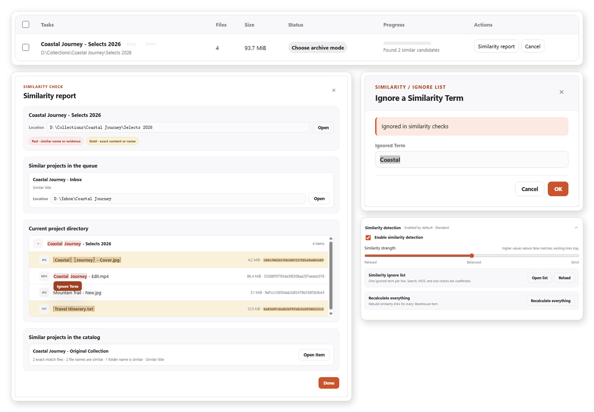

# Hamster Archiver

### Enjoy collecting. Enjoy organizing, too.

A local resource archiving tool. Quickly create browsable, searchable and easy-to-manage records for local files. 
Track storage locations and verification information, and compress resources whenever you need.

**[Download Windows stable](https://github.com/CarlosZ16420/hamster-archiver/releases/latest)** · **[Download Mac beta](https://github.com/CarlosZ16420/hamster-archiver/releases/tag/v4.8.6-beta.mac.1)** · [简体中文](README.md) · [Report an issue](https://github.com/CarlosZ16420/hamster-archiver/issues)

[Quick start](#quick-start) · [Features](#features) · [FAQ](#frequently-asked-questions) · [Experimental AI integration](#experimental-ai-integration) · [Documentation and contributions](#documentation-and-contributions)

Are downloads and backups piling up, filling your drive before you have a chance to organize them?

- Folders are scattered everywhere, and you are unsure how to categorize them or what to delete.
- You want cloud backups without having your private photos and videos reviewed or processed.
- You plan to compress files before uploading, but worry about ending up with archives whose contents you cannot see.

**Start by adding one resource folder.** Hamster Archiver creates a local library of folders and videos with covers, previews, directory manifests and tags. When you need a backup, create archives in batches, with optional passwords and split volumes, and update local records automatically.

**Back up resources wherever you like and keep lightweight records locally, so you can always see what they contain, find where they are stored and check them against the recorded information.**

### One library, two ways to organize

| Your goal | How it works |
| --- | --- |
| **Organize locally: manage the collection on your computer first** | Originals stay in place while the app creates previews and manifests. Categorize, tag and write notes in the library; send these projects for compression later when you need a backup. |
| **Package backups: store resources in the cloud or on another drive** | Compress and verify in batches, then record backup locations. Local thumbnails and directory trees show what each archive contains. |

The app packages files and keeps records; your cloud storage or drives hold the resources. Library categories do not rearrange folders on disk.

## Quick start

### Windows

1. Download the [Windows stable release](https://github.com/CarlosZ16420/hamster-archiver/releases/latest): use the **Setup EXE installer**, or extract the entire **portable ZIP / 7z** (`HamsterArchiver-v4.8.6-win-x64/`) and run `HamsterArchiver.exe`.
2. In the Archive Workbench, scan a directory or drop folders and videos.
3. To organize your collection, choose **uncompressed intake**. To prepare a backup, choose **compressed intake** and select an output folder. Open the Warehouse afterward to browse and categorize.

Windows x64 is supported, with English and Chinese interfaces. Compression and video-preview tools are included; no separate Node.js installation is needed. Download a Release package; GitHub Source code downloads are for development.

ZIP and 7z contain the same program. The 7z download is smaller and needs a tool that supports 7z extraction. Every installer or archive includes a same-name `.sha256` file to check the download.

Scanning a parent directory adds its immediate subfolders and videos as separate projects; put loose files in folders first. Projects smaller than 100 MB are filtered by default; adjust or disable the filter in intake settings.

### Mac beta

The current Mac release is **4.8.6-beta.mac.1, a test version**, and still lacks real-world testing. Take care to protect your files when using it.

It supports macOS 12 or later on Apple Silicon and Intel. Download a **DMG** from the [Mac beta release](https://github.com/CarlosZ16420/hamster-archiver/releases/tag/v4.8.6-beta.mac.1), open it and drag the app to Applications. Alternatively, extract the **ZIP** and move the `.app` to Applications or another writable folder. Data remains in your user directory and does not travel with the `.app`.

This Beta is ad-hoc signed and not notarized by Apple. Verify the download's SHA-256 first, then launch the copied app from your chosen folder. If the first launch is blocked, follow the [first-launch guide](platforms/macos/README.en.md#first-launch), which links to Apple's illustrated instructions. Skip the confirmation steps if the app opens normally; users do not need an Apple developer account. 7-Zip is included; video frame extraction requires your own FFmpeg setup. Keep or move originals after archiving; automatic moves to Trash and related restoration are unavailable.

**Please help with testing:** start with a small copy when checking scanning, archiving, updates and recovery. Keep originals, an exported Warehouse and a separate user-data backup. If you encounter an error, include your macOS version, Mac chip type, app version, steps and error details in feedback, and redact private paths and passwords.

Mac checks for new Betas in the background, but **installs only after you choose a version and confirm restart**. You can also select a local DMG / ZIP in the update dialog. Manual updates require the original release filename and a same-name `.sha256` file in the same folder; the target version must be newer than the installed version. Export the Warehouse and back up user data before rolling back online. The older `4.8.0-beta.mac.2` has no in-app updater and needs a manual first upgrade. See the [Mac guide](platforms/macos/README.en.md) for installation and verification steps.

## Features

### View complete records and easily categorize, find and manage resources

Keep complete directory trees and thumbnails, with frames automatically extracted from videos. Adjust thumbnail counts in settings, add notes and markers, and edit or add record content, including images.

Use fuzzy search by date, note content, filename, tags and more. Organize with tags and assign multiple tags to the same file.

### Keep the library in step with your folders

Uncompressed folders support **Review Updates**: additions merge automatically, while modifications and deletions are shown for review. Choose to update, create a new project or skip. If a folder moves, reconnect its source location in the project details.

### See why resources match, then decide

Similarity is calculated from file MD5 hashes, filenames and other information, grouped by similarity level and reported automatically when adding resources to the library. Optionally skip complete duplicates, manually add terms to the ignore list and adjust how loosely similarity is judged.

### Package batches your way

Choose **7z / ZIP, passwords and custom split volumes**. Queue batches, pause or schedule work, and add the next batch while the current one runs. Video frame counts and thumbnail limits are configurable.

The app tests archive integrity and checks the file manifest at the final destination, then registers the project before handling originals according to your settings. Failed verification leaves originals in place.

## Frequently asked questions

Will packaging immediately free up space?

Videos and images may not shrink much, and creating archives requires additional space. You can save them to another drive. The app verifies local output; **it does not wait for or verify cloud uploads**. Keep originals until you have confirmed the backup yourself. Local archives and Recycle Bin files still use disk space.

Where do files and library data live?

Uncompressed intake leaves originals in place and stores an index and thumbnails. Archives go to your chosen destination. Windows portable builds use adjacent `userdata` by default; installed builds use Windows user data, retained by default on uninstall. Mac uses `~/Library/Application Support/Hamster Archiver/`. Change the data location in More settings.

The app does not upload resources. It contacts GitHub for update checks and downloads.

How do I update? Does a library export back up all my files?

Background checks on Windows and Mac only discover new versions; they do not install them. Choose a target version in Check for updates and confirm before upgrading.

- **Windows:** online portable updates prefer a verified 7z and use the same-version ZIP if it is unavailable. For manual updates, choose a newer ZIP / 7z for a portable build or a Setup EXE for an installed build.
- **Mac Beta:** choose a version online and confirm restart, or select a newer local DMG / ZIP. Keep the original package filename and its same-name `.sha256` file in the same folder. See the [Mac guide](platforms/macos/README.en.md) for details. The older `4.8.0-beta.mac.2` still needs a manual first upgrade.

**Library exports contain only the index and thumbnails, not originals or archives.** Back those up separately. If an older version has no working updater, export the library, import it into the new app, and verify the result before retiring the old directory.

## Experimental AI integration

An AI agent with local tool access can search the library, add tags and submit intake or compression tasks. For example: “Catalog this folder without compression and keep the originals.” The app validates and queues tasks, and you can follow them in the Archive Workbench.

Using the project with an AI agent? Read the [AI quick start](docs/AI-QUICKSTART.md). Windows packages include `hamster.cmd` and an offline guide; the Mac beta includes an in-app CLI. For ongoing integration, enable the desired adapter under **More settings → Experimental → AI assistant integration**.

This is an optional experimental feature. The AI client can see returned paths, titles, tags, notes and other metadata; Hamster Archiver itself does not upload media to an online model. Availability depends on the client, system and permissions.

More details: [CLI reference](docs/CLI.md) · [MCP reference](docs/MCP.md) · [Troubleshooting](docs/AI-TROUBLESHOOTING.md)

## Documentation and contributions

- [Changelog](CHANGELOG.md): published changes and work awaiting release.
- [Report an issue or suggestion](https://github.com/CarlosZ16420/hamster-archiver/issues): include the version, steps and error details; redact private paths and passwords.
- [Contributing](CONTRIBUTING.md) · [Development guide](docs/DEVELOPMENT.md) · [Security](SECURITY.md) · [MIT License](LICENSE)

Hamster Archiver started as a small tool for my own collection. I hope it helps you enjoy collecting and organizing, too. Thanks to 7-Zip, FFmpeg, the LinuxDo community and everyone who tries the app and shares feedback. If it helps you, a Star or a suggestion is always welcome.

## Friends

- [LINUX DO](https://linux.do/)
