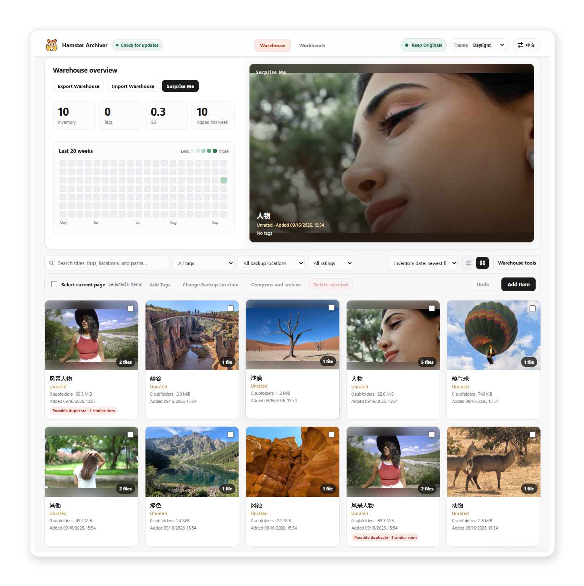
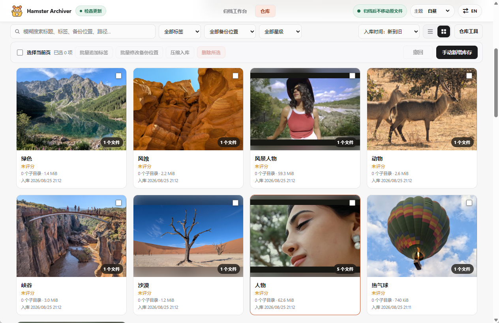
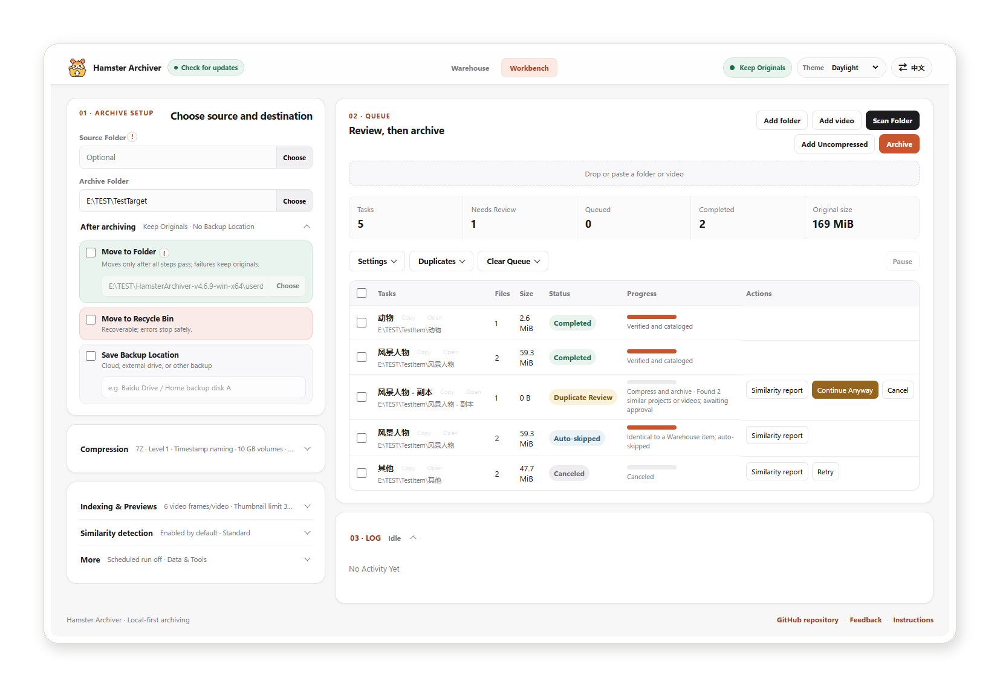
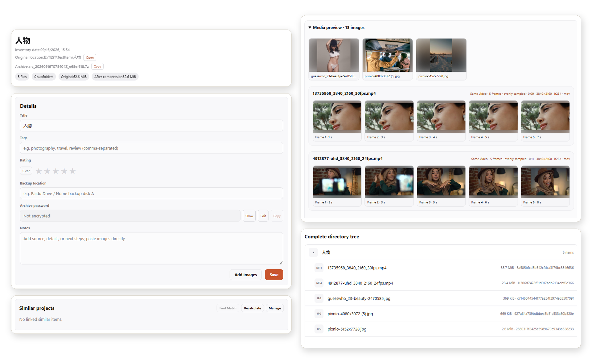

# Hamster Archiver

### Enjoy collecting. Enjoy organizing, too.

Local-first file organizer, media library, and verifiable batch archiver for Windows, now with a public macOS beta. Optional local CLI/MCP interfaces support capable AI agents as an experimental feature.

**[Download Windows stable](https://github.com/CarlosZ16420/hamster-archiver/releases/latest)** · **[Download Mac beta](https://github.com/CarlosZ16420/hamster-archiver/releases/tag/v4.8.0-beta.mac.2)** · [简体中文](README.md) · [Report an issue](https://github.com/CarlosZ16420/hamster-archiver/issues)

[Quick start](#quick-start) · [Features](#everyday-ease-supported-by-careful-details) · [Experimental AI integration](#experimental-features) · [FAQ](#frequently-asked-questions) · [Documentation and contributions](#documentation-and-contributions)

Using this project with an AI agent? Go straight to the [short AI guide](docs/AI-QUICKSTART.md). The Windows stable package includes `hamster.cmd` and the offline guide, and the Mac beta includes an in-app CLI; ordinary use needs no source checkout, separate Node.js install, or MCP setup.

Downloads keep piling up, your drive is almost full, and organizing everything never gets done?

- Folders are scattered everywhere. You do not know how to categorize them or what you can afford to delete.
- You want a cloud backup but would rather not upload original pictures and videos for online viewing and processing.
- You plan to package files before uploading, but worry about ending up with archives whose contents you cannot recognize.

**Start by adding one folder.** Hamster Archiver builds a local library of folders and videos with covers, previews and directory manifests. Organize your collection with tags, ratings and notes. When you need a backup, create archives in batches, with optional passwords and split volumes, ready for you to upload or store on another drive.

**Your files can live elsewhere while a clear record of their contents and backup locations stays on your computer.**

Actual application views; some labels in these screenshots may differ from the current version.

## One library, two ways to organize

| Your goal | What you get |
| --- | --- |
| **Organize the files already on your computer** | Originals stay in place while the app creates previews and manifests. Categorize with tags and notes in the library, and queue those records for compression later if needed. |
| **Prepare backups for cloud storage or another drive** | Batch compression, integrity verification and catalog registration. Record the backup location; local covers, video frames and directory trees show what each archive contains. |

The app packages files and records them; you or your sync tool handles cloud uploads. Local organization uses catalog metadata such as tags and does not automatically rearrange folders on disk.

Choose Review Updates from an uncompressed folder's details or a selected batch. The task takes one complete snapshot when it runs: additions merge automatically, while modifications, deletions or incomplete older manifests require review. Choose to overwrite the record, create an independent record or skip. Unchanged files reuse existing MD5 fingerprints and previews without extracting video frames again; review updates leave originals untouched. Dropping the same source again leads to review updates or compression.

After submitting a review, check progress and pending decisions in the Archive Workbench. Completion notices distinguish an unchanged folder from an updated Warehouse; manual action, failure and cancellation also receive specific feedback.

The Archive Workbench uses a scrolling list for more than 10 tasks. Returning from the library recalculates its visible height, so existing tasks appear without adding another item.

Finish or cancel a pending review or compression task before deleting its linked uncompressed Warehouse item. If the item is deleted first, adding the same source again starts a new item.

After moving originals, reset their location in the item details. This changes the association; the next review update or compression checks the contents. When compressing an uncompressed item, choose whether to preserve or update an existing backup location if it conflicts with the new settings.

Intake automatically detects duplicates and can skip existing content while still providing a similarity report. Large directories remain responsive, and the whole library is quick to search.

## Quick start

The Windows 4.8.3 stable release supports **Windows x64**, with English and Chinese interfaces. To use the app, choose a [Release package](https://github.com/CarlosZ16420/hamster-archiver/releases/latest); GitHub Source code downloads and repository clones are for development.

1. Download the **Setup EXE installer**, or extract the entire **portable ZIP** and run `HamsterArchiver.exe`.
2. In the archive workbench, scan a directory or drop folders and videos, then review the pending resources. The small-item filter defaults to 100 MB; adjust its threshold or disable it in intake settings before adding smaller projects.
3. For **local organization**, choose uncompressed intake. To **prepare backups**, start compressed intake and choose an archive folder when prompted, or set the folder beforehand. Open the library afterward to browse and organize the results.

The app opens the Warehouse by default. An empty library offers a five-step first-run guide with a language choice; you can skip or disable it permanently. Scanning a parent directory adds its immediate subfolders and videos as separate projects; put loose images and other files in folders first.

The startup window appears before archive runtime modules load, providing visible feedback earlier while the application starts.

Windows compression and video-preview tools are included, and no separate Node.js installation is needed. The download page provides a ZIP, a Setup EXE and a matching `.sha256` file for each.

Keep all included files in the Windows portable directory, `HamsterArchiver-v4.8.3-win-x64/`.

### Mac beta (Apple Silicon and Intel)

Download `HamsterArchiver-v4.8.0-beta.mac.2-mac-universal.dmg` and its `.sha256` file from the [Mac beta prerelease](https://github.com/CarlosZ16420/hamster-archiver/releases/tag/v4.8.0-beta.mac.2). Check the digest, open the DMG, then drag the app to Applications. macOS 12 or later is supported. This beta is not Apple-notarized, so macOS may block the first launch. If you trust the download, use Open Anyway in System Settings → Privacy & Security. Mac user data defaults to the current user's Application Support directory and remains when replacing the app. See the [Mac guide](platforms/macos/README.md) for feature limits and build details.

Mac remains a beta. It includes 7-Zip; video frame extraction is off by default and requires your own FFmpeg configuration. Keep or move originals after archiving; Windows Recycle Bin deletion, restoration and file undo are unavailable. Download a newer DMG and replace the app manually to update.

### Ready for modern local workflows

Beyond the desktop interface, Hamster Archiver offers optional CLI/MCP automation for scripts and AI agents with local tool access. This is an experimental feature and does not affect the default local desktop workflow.

## Store the backup elsewhere. Keep its contents in view.

Each project retains image thumbnails, sampled video frames and a complete directory tree. Choose a cover, record the extraction password and backup location, and browse what you archived without opening the archive itself.

## Everyday ease, supported by careful details

### File safety: verify before handling originals

Archive intake follows **manifest → compression → transfer and verification at the final destination → catalog registration → configured source handling**. At the final archive location, the app tests archive integrity and compares file paths, sizes and folder structure with the complete source manifest, including empty folders. Staging files remain until verification passes. Low disk space, an incomplete source manifest, mismatched archive contents and abnormal output sizes stop processing or require review. Source post-processing runs only after verification and registration succeed.

Details: file preservation and recovery

- Generate a manifest and recheck sources before compression. Cross-drive moves copy and compare complete relative paths, file sizes and empty folders before handling the source location. Structural checks do not imply byte-for-byte content verification.
- Verify archive identity before moving or cleaning up, protecting against replacement files with the same name; handle split archives as a complete set.
- Preserve generated archives for recovery if catalog registration fails. Cancellation during thumbnail generation keeps originals and cleans uncommitted outputs.
- Distinguish a failed source operation from a completed operation whose status could not be saved. This also applies after confirming an abnormal archive, preserving the actual move destination and preventing a misleading retry prompt.
- Track original-file location and disposition, with restoration of moved sources when conditions permit, plus Recycle Bin restoration on Windows. Cross-drive restoration checks the current moved contents and retains the moved copy and its recorded location.
- Imports save only new records and their referenced images without overwriting existing images. Exports generate and verify a temporary ZIP on the destination drive before replacing an older backup.
- Report invalid data locations explicitly. Data-location switches copy after normal shutdown and validate the data and window after restarting. Failures retain both data copies and roll back safely.

### Organization: preview, categorize and keep useful notes

Browse covers and build your own organization habits with tags, ratings and notes. Search titles, tags, notes, paths and filenames; results remain available across pages even when a common query matches more than 2,000 items. Record backup locations in bulk.

The list's Size column shows original size for uncompressed items and archive size for compressed items, making storage use easier to compare.

Details: organization tools and responsive browsing

- Small, medium and large thumbnails and a text list serve different browsing needs, with keyboard pagination, direct page-number entry, bulk tags, backup-location edits and undo for supported actions. Restore items deleted during the current session together with their similarity relationships; on Windows, eligible archives and thumbnails still in the Recycle Bin can also be restored.
- Tag completion reuses existing categories; accept suggestions with Tab. Selection updates in place to reduce flicker and layout jumps.
- Frames from the same video stay grouped, and portrait media remains fully visible. Change covers or add supplementary images from files or the clipboard.
- Read large-project details on demand. Load nearby visible media with bounded concurrent reads, and render directory trees virtually to reduce unnecessary work.
- Load the library in background batches with startup progress, enabling related operations once the complete data is ready. Open statistics or filter your collection from the inventory, tags and activity views.
- Both views support marquee selection, Ctrl toggling and Shift ranges, with one-click clearing across pages. Warehouse tools can hide the Uncompressed tag when preferred; a floating button returns to search and bulk actions after scrolling down.
- Store thumbnails instead of another complete copy of original media; preview counts are configurable.
- Choose from five themes and Chinese or English, with continuing refinements to dark menus, text contrast and dynamic messages.

### Similar resources: see the evidence and decide

**Similar names, identical file contents and complete duplicate projects are shown separately.** Optionally skip projects that meet complete-duplicate rules; review merely similar resources instead of letting a shared word decide for you.

Similarity reports list both catalog and queue candidates. Queue candidates are marked as not yet added to the catalog, with location-opening actions for both projects so you can compare them manually. Queue-only reports do not scan directories or calculate MD5. Catalog candidates retain detailed file comparisons.

Details: fewer false matches and bounded processing

- Highlight only the matching name fragment. Click a red term and confirm adding it to the ignore list to reduce that source of noise; gold distinguishes identical-content evidence.
- Reduce interference from short titles, numeric identifiers and common words. Adjust similarity strength, and retain manually dismissed relationships across recalculation.
- Narrow candidates with indexes, verify content as needed and stop unnecessary reads once candidates are excluded. Reuse evidence instead of scanning the whole catalog for every file.
- Use a shortcut only when the same original location and complete directory/file metadata snapshots match. Otherwise verify content; matching names or sizes alone cannot justify automatic skipping.
- Projects from different locations are not complete duplicates if their directory structures or empty folders differ, even when all file contents match.
- Large-folder safeguards bound representative files for ordinary similarity analysis and can omit tiny-file MD5 records from that analysis. "Skip Tiny Files for MD5" is off by default, with a default threshold of 1 KB; existing saved settings are preserved. Complete manifests and archives still cover all files.
- Changing similarity strength does not start a full-library rebuild automatically. Choose single-project or full recalculation yourself.

### Packaging: fit your backup habits

Choose 7z/ZIP, passwords and custom split volumes. Queue batches, pause or schedule work, and adjust compression, sampled video frames and thumbnail counts.

Details: compression, password records and batch tasks

- Compression levels 0–9 and configurable 64 MiB–100 GiB split volumes, defaulting to 10 GiB. Splitting applies only when the source total exceeds the volume size; disabling it keeps archives whole. Tools are included in release packages.
- “Require Confirmation for Large Split Archives” under Scan & Queue → Settings → Performance is on by default. Turning it off permits automatic splitting and releases pending desktop volume confirmations; the queue still requires a manual start. Other risk confirmations remain, and inventory-only intake needs no volume confirmation.
- Set an archive password and record extraction passwords per project. Records remain masked until revealed for viewing or copying; protect the local user data that holds them.
- Run 1–3 tasks concurrently, pause, finish the active tasks before pausing, schedule runs and view remaining-time estimates. While running or paused, scan, drop or manually add resources, or add Warehouse items to the next batch. They stay in the Ready area outside the current batch; memory limits or source, record and output conflicts delay new starts.
- With tasks selected, start only applicable selected tasks; without a selection, start all applicable pending tasks. One task failing or being cancelled does not stop other active tasks. Clear the entire queue only after the current batch ends.
- Blocked starts explain active processing or pending manual action and highlight the relevant queue items. After the batch ends, clear completed tasks (including duplicate skips) or cancelled tasks separately. This removes queue entries while preserving Warehouse records, archives, originals and durable receipts; items with unresolved source-status save failures are excluded from completed-task cleanup.
- Configure video frame counts and per-project thumbnail limits; task settings are saved with each job.
- Password protection does not guarantee that a third-party storage provider will never review or remove files.

## Experimental features

### AI / agent collaboration

An assistant with local tool access can search the library, add tags, and submit inventory-only or compressed archive tasks. For temporary use, run `hamster.cmd` from a complete Windows Release package or `Contents/Resources/hamster` inside the Mac app without registering a host.

For ongoing integration, enable the desired adapter under **More settings → Experimental → AI assistant integration**. Host registration is off by default, and each adapter can be disabled independently. Setup EXE provides a stable path and managed upgrade/uninstall lifecycle; the portable ZIP can use the CLI directly.

Available adapters include Codex / ChatGPT Desktop, optional Codex MCP, WorkBuddy, generic MCP, and a Windows ODR discovery preview. Actual host support depends on that client and the operating system.

For example: “Use Hamster Archiver to catalog this folder without compression and keep the originals.” The app validates, queues, and saves results. Meaningful project boundary ambiguity remains a choice; existing records are identified as reused, updated, or skipped.

Duplicate decisions list supported actions and explain why reuse is unavailable without a trusted content match. Explicit reuse preserves the existing record's compression state; reusing a compressed record does not create an uncompressed record in this run.

Receipts distinguish created, updated, reused, skipped, failed and cancelled results, and saved results remain available after queue cleanup. Recover an uncertain submission with `task pending` and `task resume`. Review paginated source changes and explicitly choose overwrite, independent creation or skip; archive anomalies and Recycle Bin safety decisions still require desktop review. View background AI tasks through the system tray or menu bar and their source labels in the shared workbench.

> This is experimental. The AI client can see returned paths, titles, tags, notes, and other metadata; Hamster Archiver itself does not upload media to an online model. Availability depends on the selected client, operating system, and permissions.

[AI quick start](docs/AI-QUICKSTART.md) · [CLI reference](docs/CLI.md) · [MCP reference](docs/MCP.md) · [Troubleshooting](docs/AI-TROUBLESHOOTING.md)

## Frequently asked questions

Will packaging immediately free up space on a nearly full drive?

Packaging organizes files for backup; it does not guarantee substantial size reductions for videos or images. Output files require available disk space, so you can select another drive with enough room.

Confirm that the backup is safely stored at its destination before deciding what to do with local files. Local archives and Recycle Bin contents still consume space. Source post-processing happens after local verification and registration; **it does not wait for or verify cloud uploads**. If you intend to clean up after uploading, keep originals first and verify the backup yourself.

Where do files and library data live?

Local organization leaves originals in place and stores an index and thumbnails. Backup archives go to your selected destination. Windows portable builds default to adjacent `userdata`; Windows installed builds use Windows user data, retained by default on uninstall. The Mac build defaults to `~/Library/Application Support/Hamster Archiver/`. More settings provides a safe location-switching workflow.

The application does not upload resources; you or your sync tool handles uploads. It contacts GitHub for update checks and downloads. When using AI, returned metadata enters the chosen client's context.

Can I view runtime logs after closing the app?

Yes. Runtime logs remain in `logs/app.log` inside the active user-data area, and the next launch restores the latest 300 valid entries in the interface. Logs cover task processing, changed setting fields, user-data-area switches, update actions, and critical errors, but never password values or routine searching, browsing, and copying.

How do I update? Does a warehouse export include my originals?

On Windows, open Check for updates to read published stable release notes since your current version. Online checks accept stable releases from the public main branch; beta releases are excluded, and background checks do not open the update window. Portable builds download a ZIP and installed builds a Setup EXE, each verified against its SHA-256. Portable updates support failure rollback; installers upgrade the existing installation. The first launch after an update shows what changed.

If networking is unavailable, download a newer release and choose Manual update: select a ZIP for portable builds or a Setup EXE for installed builds. A manually selected portable ZIP may be a newer beta if its version and integrity checks pass. On Mac, download a newer DMG and replace the app manually.

If an older version has no working updater, export the warehouse and import it into a new copy of the app. Verify records and thumbnails before retiring the old directory. **Warehouse exports contain the index and thumbnails, not original files or archive outputs**; keep those separately.

## Documentation and contributions

| What you need | Where to go |
| --- | --- |
| Downloads and published versions | [Releases](https://github.com/CarlosZ16420/hamster-archiver/releases) |
| Mac beta installation and platform limits | [Mac guide](platforms/macos/README.md) |
| Experimental AI / CLI / MCP integration | [AI quick start](docs/AI-QUICKSTART.md) · [CLI reference](docs/CLI.md) · [MCP reference](docs/MCP.md) · [Troubleshooting](docs/AI-TROUBLESHOOTING.md) |
| Feature changes | [Changelog](CHANGELOG.md) (`Unreleased` marks changes awaiting release) |
| Bug reports or feature suggestions | [Issues](https://github.com/CarlosZ16420/hamster-archiver/issues): include the version, steps and error details; redact private paths and passwords |
| Code or documentation contributions | [Contributing](CONTRIBUTING.md) · [Development guide](docs/DEVELOPMENT.md) |
| Security reports and licensing | [Security](SECURITY.md) · [MIT License](LICENSE) |

Source development requires Windows or macOS, Node.js 22.12+ on 22.x or 24.x, and npm 10.x/11.x. See the development guide for dependency, Electron runtime and bundled-tool setup.

Hamster Archiver started as a small tool for my own collection. I hope it helps you enjoy organizing yours, too. Thanks to 7-Zip, FFmpeg, the LinuxDo community and everyone who tries the app and shares feedback. If it helps you, a Star or a suggestion is always welcome.
