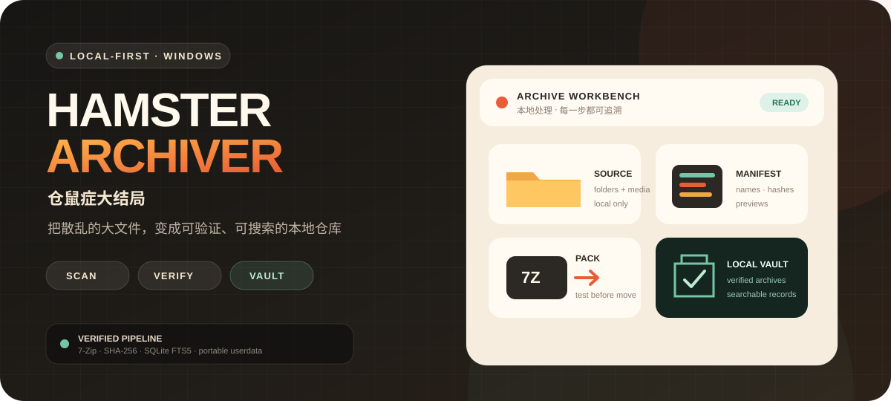
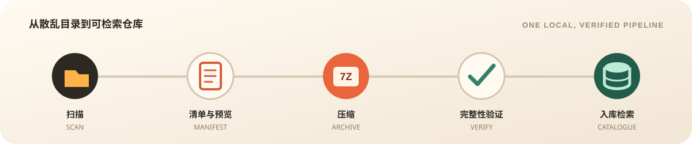

<div align="center">


</div>



<div align="center">

[](../../releases/latest)


[](https://github.com/CarlosZ16420/hamster-archiver/actions/workflows/ci.yml)

**本地优先的批量归档器，也是能搜索、能预览的媒体仓库。**

[下载 Windows 版](../../releases/latest) · [English](README.en.md) · [报告问题](../../issues) · [参与贡献](CONTRIBUTING.md)

</div>

## 给堆满硬盘的人

普通压缩工具只留下压缩包。Hamster Archiver 会为每个一级文件夹或视频建立独立任务，生成清单和媒体预览，完成压缩与完整性验证，再把标题、路径、标签、缩略图和文件指纹登记进本地 SQLite 仓库。

- 文件多到像考古：按标题、标签、备注、路径和文件名搜索。
- 害怕重复收存：入库前比较标题、视频名、大小与精确指纹，疑似关系交给你确认。
- 不想交给云端扫描：仓库、缩略图、密码记录和运行日志都留在本机。

## 看见你的仓库，而不只是压缩包


仓库保留完整目录结构，并把图片与视频抽帧变成可浏览的缩略图。项目可以设置封面、标签、星级、备注、备份位置和独立解压密码；大缩略图、纯文本列表、活跃度和随机漫步适合不同整理方式。

<details>
<summary><strong>展开查看项目详情与视频分帧</strong></summary>


</details>

## 一条可追溯的本地流水线



1. 扫描主目录，或手动加入单个文件夹、视频。
2. 生成目录清单、MD5、图片缩略图和视频均匀抽帧。
3. 用随附的便携版 7-Zip 创建 7z/ZIP，可选密码、等级和 64 MiB—10 GiB 分卷。
4. 运行完整性测试；体积异常、大任务和疑似重复会停下来等待确认。
5. 成功入库后，才按设置保留、移动或回收原文件。

## 核心能力

| 安全归档 | 可搜索仓库 | 本地与便携 |
|---|---|---|
| 压缩前复核清单与磁盘空间 | SQLite WAL + FTS5 持久索引 | 媒体和仓库不主动上传 |
| 成品完整性测试与异常体积确认 | 标题、标签、备注、路径、文件名搜索 | `userdata` 可随应用携带或切换 |
| 多卷成品隔离、整组发布与回滚 | 封面、缩略图、目录树、随机漫步 | 应用目录移动后可重定位自有数据 |
| 跨盘移动先复制、核验、再删除 | 精确重复与本地相似关系提示 | 中英文界面与五套完整主题 |

### 重复与相似关系

- 精确文件使用大小与 MD5 共同核验；相似度按标题和视频证据分级计算。
- 单个泛词、短标题和格式词不能独立把不同项目标成重复。
- 仓库标签筛选可直接选择“可能重复”；关系可单项重算、全库重建或双向解除。
- 相似度排除词表可维护常见厂牌和编号前缀；切换强度不会隐式重算全库。

### 队列与文件安全

- 支持暂停、完成当前项后暂停、定时运行和基于历史速度的剩余时间估算。
- 无法读取的文件会跳过并记入日志；存在跳过项时保留源项目。
- 当前任务移入 Windows 回收站后立即复核；无法确认时停止队列，不抽查历史项目。
- 删除仓库记录可选择恢复已移动或已回收的原文件；恢复失败不会继续删除记录与压缩包。

## 快速开始

1. 从 [Releases](../../releases/latest) 下载 Windows x64 ZIP。
2. **完整解压**到一个文件夹，运行 `HamsterArchiver.exe`。
3. 选择待收存主目录和压缩包存放点，扫描、确认队列并开始归档。

> 不要只复制 EXE。Electron、7-Zip、FFmpeg 和更新校验依赖完整发行目录。

### 更新

点击“检查更新”会显示当前版本与最新版本：有新版时可自动更新；无论是否联网、是否已有新版，都可以选择“手动更新”并指定完整的 Windows x64 发行 ZIP。程序会验证版本、平台、发行清单和关键文件，替换时排除现有 `userdata`，失败则回滚。

<details>
<summary><strong>从 4.2.0 手动迁移</strong></summary>

4.2.0 内置的旧更新脚本不能正确替换 `resources`，需要手动升级一次：

1. 在旧版仓库中“导出仓库”，然后完全退出应用。
2. 把最新 ZIP 完整解压到一个**新文件夹**，不要覆盖仍在运行的旧目录。
3. 运行新版并选择“并入外部仓库”，导入上一步的仓库 ZIP。
4. 核对版本、记录和缩略图；确认前保留旧程序目录。

</details>

## 便携数据布局

```text
HamsterArchiver-v4.5.6-win-x64/
├─ HamsterArchiver.exe
├─ tools/                  # 7-Zip 与 FFmpeg
├─ resources/              # Electron 应用代码
└─ userdata/
   ├─ config/              # 设置与相似度排除词表
   ├─ warehouse/           # SQLite 仓库与缩略图
   ├─ logs/                # 当前用户运行日志
   ├─ processed/           # 默认的已处理原文件去向
   └─ electron/            # 本地界面缓存
```

用户数据区可能包含密码、个人路径和媒体缩略图，因此被 Git 忽略且不会进入公开源码或 Release ZIP。你可以在“更多设置”中把数据复制到空目录，或切换到另一个已存在的数据区；旧目录会保留，两个仓库不会静默合并。

## 技术边界

| 领域 | 实现 |
|---|---|
| 桌面端 | Electron 43、上下文隔离、sandbox、严格 CSP |
| 数据 | Node 内置 SQLite、WAL、事务、FTS5 |
| 压缩 | 便携版 7-Zip 26.02、7z/ZIP、完整性测试 |
| 媒体 | 单个便携 FFmpeg 完成探测与均匀抽帧 |
| 性能 | 仓库分页、目录虚拟化、持久化搜索与相似候选索引 |
| 网络 | 仅检查更新或打开 GitHub 链接时访问 GitHub；不负责上传归档包 |

## 从源码运行

需要 Windows、Node.js 22.12+（22.x）或 24.x，以及 npm 10.x/11.x。

```powershell
git clone https://github.com/CarlosZ16420/hamster-archiver.git
cd hamster-archiver
npm ci
npm run verify:dependencies
npm run check
npm test
npm start
```

源码仓库不提交体积较大的 `ffmpeg.exe`。`dependency-lock.json` 固定 Electron、7-Zip、FFmpeg 的版本、来源与关键摘要；需要恢复工具时运行 `npm run tools:prepare`，正式构建前运行 `npm run verify:tools`。

维护机的构建、用户数据和公开快照应放在源码仓库外。开发模式使用隔离数据；本地发行和版本规则见 [开发指南](docs/DEVELOPMENT.md) 与 [发行流程](docs/RELEASE.md)。

## 贡献

提交前请运行 `npm run verify:dependencies`、`npm run check`、`npm test` 和 `npm run publish:check`。不要提交用户数据、数据库、日志、压缩包、密码、真实媒体或个人绝对路径；详见 [CONTRIBUTING.md](CONTRIBUTING.md) 与 [SECURITY.md](SECURITY.md)。

本项目采用 [MIT License](LICENSE)。7-Zip 和 FFmpeg 遵循发行包中随附的许可证。

<div align="center">

**把“我好像存过”变成可验证、可搜索的答案。**

[下载最新版](../../releases/latest) · [提交 Issue](../../issues) · [查看版本记录](CHANGELOG.public.md)

</div>
