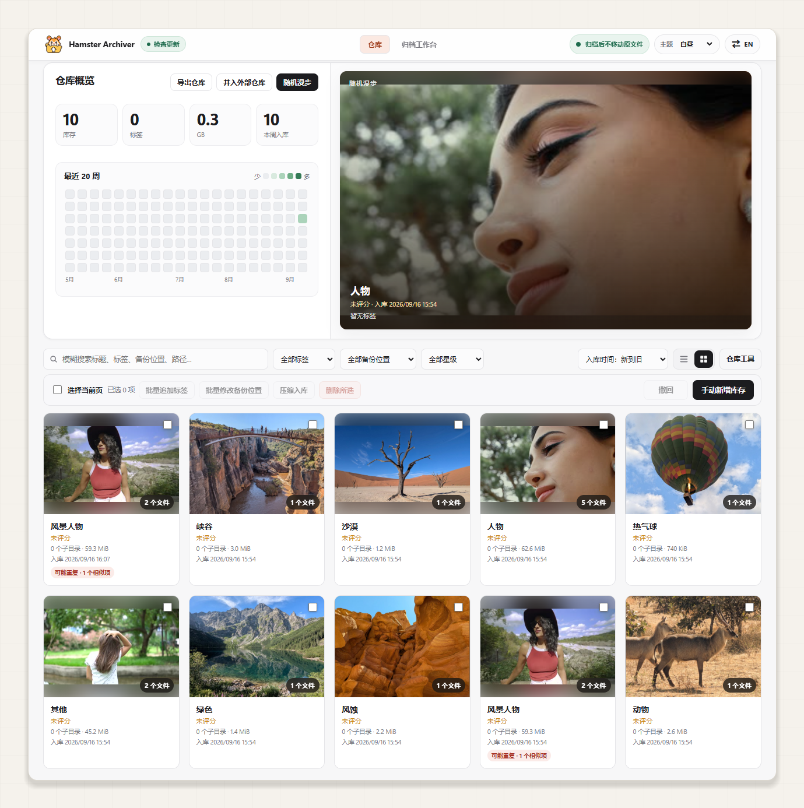
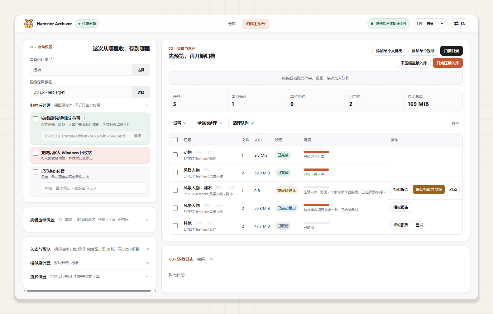
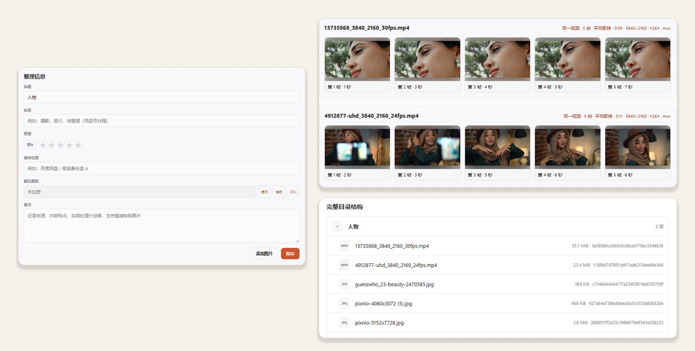

# 仓鼠症大结局 Hamster Archiver

### 收藏的时候很快乐，整理的时候也应该是。

Windows 本地文件整理、媒体建库与可校验批量归档工具；支持 AI 通过 MCP 调用。

**[下载 Windows 版](https://github.com/CarlosZ16420/hamster-archiver/releases/latest)** · **[让 AI 帮你使用](docs/AI-QUICKSTART.md)** · [English](README.en.md) · [反馈问题](https://github.com/CarlosZ16420/hamster-archiver/issues)

[快速开始](#快速开始) · [AI 使用](#让-ai-帮你收纳) · [功能介绍](#把整理做顺手也把细节做好) · [常见问题](#常见问题) · [文档与贡献](#文档与贡献)

下载/备份的资源越积越多，硬盘快满了，却一直没整理好？

- 文件夹散落各处，不知道怎么分类，也舍不得随便删。
- 想备份到网盘，又不愿让隐私图片、视频被审核和处理。
- 准备先压缩再上传，却又担心以后只剩一堆看不出内容的压缩包。

**从添加一个资源文件夹开始。** Hamster Archiver 为文件夹和视频建立带封面、预览与目录清单的本地仓库，让你用标签、星级和备注整理收藏；需要备份时，再批量生成压缩包，按需设置密码和分卷，方便自行上传到网盘或保存到其他硬盘。

**资源可以备份到别处，里面有什么、备份放在哪里，仍在本地留下清楚的记录。**

## 一座资源仓库，两种整理方式

| 这次想做什么 | 你会得到什么 |
| --- | --- |
| **本地整理：先把电脑里的收藏管起来** | 原文件保持原位，为资源生成预览和清单，在仓库里分类、打标签、写备注。以后需要备份，还能把这些项目继续送去压缩。 |
| **打包备份：把资源存储到网盘或其他硬盘** | 批量压缩、完整性验证、登记仓库、记录备份位置；本地仍能看封面、视频抽帧和目录，知道每个压缩包装了什么。 |

打包和仓库登记由应用完成，网盘上传由你或同步工具完成；本地分类通过仓库标签等信息管理，不会自动重排磁盘上的文件夹。

## 快速开始

适用于 **Windows x64**，提供中英文界面。直接使用请选择 [Releases 发行包](https://github.com/CarlosZ16420/hamster-archiver/releases/latest)；GitHub 的 Source code 和克隆仓库用于源码开发。

1. 下载 **Setup EXE 安装版**，或完整解压 **ZIP 便携版**后运行 `HamsterArchiver.exe`。
2. 在“归档工作台”扫描目录，或拖入文件夹、视频，查看待处理内容。第一次可以先添加一个小文件夹。
3. 想先做**本地整理**，点击“不压缩直接入库”；准备**打包备份**，在“收纳设置”中填写“压缩包保存在”，点击“开始压缩入库”。完成后到“仓库”浏览和整理。

便携版请保留完整目录，例如 `HamsterArchiver-v4.6.10-win-x64/`，不要只复制 EXE。压缩和视频预览所需工具已随发行包提供，无需另装 Node.js。

## 让 AI 帮你收纳

能够在目标 Windows 电脑上执行本地命令或连接本地 MCP 的 AI 助手，可以调用程序查询收藏、添加标签、提交入库任务并跟踪结果。仅有网页搜索能力的聊天助手可以提供操作指导，不能直接访问你的本机文件。项目提供 AI 工具接口，不内置在线内容识别模型。

把下面这段话交给具备本机操作能力的 AI，并替换其中的目录：

> 请使用 Hamster Archiver（https://github.com/CarlosZ16420/hamster-archiver），把 D:\Downloads\示例项目不压缩入库，保留原文件。先阅读项目的 AI 快速上手并复用已有安装；需要安装时下载并校验 Windows 发行包。按实际安装包的能力选择兼容流程，完成只读连接检查后执行任务，并核实最终结果。

**版本与能力：** 下载包与当前源码可能处于不同阶段，[更新日志](CHANGELOG.md) 中的 `Unreleased` 表示尚未发布的改动。启动诊断、任务预检和托盘任务入口等能力，以安装包实际提供的内容为准。

AI 应先读取包内 `ai-capabilities.json`：只有 `schemaVersion: 2` 且 `cliCommands` 包含 `doctor` 时才运行自检；缺少声明的旧包按包内或对应版本的 `docs/MCP.md` 接入，不用未知命令试探。完整配置、示例和故障处理见 [AI 快速上手](docs/AI-QUICKSTART.md)。

连接后，AI 先确定本次入库方式；用户已经明确指定时直接沿用。不压缩入库始终保留原文件，不要求压缩包位置或密码；压缩入库复用已保存的偏好，只补问缺失的成品位置和原文件处理方式，密码始终可选。支持任务预检的版本会在提交前核对范围，提交后持续跟踪到最终状态。

支持托盘任务入口的版本可随时打开工作台，查看带“AI 提交”标记的任务。任务结果应说明成功、跳过或失败的数量，以及仓库记录和成品位置。应用自身不上传媒体；返回的标题、路径等元数据会进入你连接的 AI 客户端上下文。

## 备份到别处，内容仍然看得见

每个项目都保留图片缩略图、视频抽帧和完整目录结构。你可以为它选封面、记下解压密码和备份位置；即使暂时不打开压缩包，也能浏览归档的内容。

## 把整理做顺手，也把细节做好

### 文件安全：先核验，再处理原文件

压缩入库按 **生成清单 → 压缩 → 完整性验证 → 登记仓库 → 按设置处理原文件** 的顺序执行。磁盘不足、异常体积等情况会停止或要求确认，验证与登记成功后才执行原文件后处理。

展开：为文件保全和异常恢复做了哪些工作？

- 压缩前生成清单并复核源文件；跨盘移动先复制、核验，再处理源位置。
- 归档成品在移动与清理前复核文件身份，避免误处理被同名替换的文件；分卷成品按整组处理。
- 仓库写入失败时保留已生成成品供恢复；缩略图阶段取消任务时保留源文件，并清理未提交生成物。
- 区分“源文件操作失败”和“操作已完成但状态保存失败”，把恢复线索写入诊断信息。
- 追踪原文件位置与处理状态；符合条件时，可将已移动或已回收的原文件复原。
- 数据位置失效时明确提示；安全切换数据位置时保留原目录，避免无声打开空仓库。

### 便于整理：看预览，分好类，记清楚

用封面浏览收藏，用标签、星级和备注建立自己的分类习惯。标题、标签、备注、路径和文件名都能搜索，备份位置也可以批量记录。

展开：整理工具与轻快浏览的细节

- 大缩略图与文本列表满足不同浏览习惯；支持键盘翻页、批量追加标签、修改备份位置，以及支持操作的撤回。
- 标签自动补全复用已有分类，可用 Tab 接受建议；选中项目时原位更新状态，减少闪烁和页面跳动。
- 同一视频的多帧预览成组展示，竖屏画面完整保留；封面可更换，也可手动添加或粘贴补充图片。
- 大项目详情按需读取，媒体靠近可见区域才加载，同时限制图片读取数量；目录使用虚拟列表，减少无效渲染。
- 仓库保存缩略图而非再复制一整套原始媒体，预览数量可调。
- 提供五套主题与中英文界面，持续完善深色菜单、文字对比度和动态提示。

### 相似资源：给出依据，让你决定

**名称相似、文件内容一致、整个项目重复，分开显示。** 符合完整重复规则时可按设置自动跳过；只是相似的资源保留确认机会，避免因为一个公共词就替你作决定。

展开：怎样减少误报，又控制检查成本？

- 名称相似只标出实际匹配片段；点击红色词语，可确认加入排除词表，减少这类词造成的干扰。内容一致证据用金色区别显示。
- 相似判断降低短标题、数字编号和公共词的干扰；支持调整强度，手动解除的关系在后续重算时仍保持排除。
- 先用索引缩小候选，再按需核验内容；候选排除后停止多余读取，报告复用已有证据，避免逐文件遍历整个仓库。
- 同一原始位置且完整目录、文件路径、数量和大小快照都一致时，可走快捷重复判断；不满足条件时继续内容核验，不能只靠同名或同大小自动跳过。
- 大文件夹“卡顿规避”限制普通相似分析的代表文件数量，并可跳过极小文件的普通 MD5 记录；完整目录清单和归档内容仍覆盖全部文件。
- 调整相似强度不会擅自启动全库重算；单项或全库重算由你选择。

### 打包方式：按你的备份习惯来

支持 7z/ZIP、密码和自定义分卷；资源多时可以批量排队、暂停或定时运行。压缩、视频抽帧和缩略图数量都可调整。

展开：压缩、密码记录与批量任务

- 压缩等级 0—9，主动分卷大小可设为 64 MiB—10 GiB；工具随发行包提供。
- 可设置压缩密码，并按项目记录解压密码；记录默认遮盖，主动显示后可查看或复制。密码记录随本地用户数据保存，应一并妥善保管。
- 队列支持暂停、完成当前项后暂停、定时运行和剩余时间估算；桌面运行期间还能继续添加下一轮资源。
- 视频抽帧数与单项目缩略图上限可自定义，设置随任务保存。
- 密码保护不等于网盘保管承诺；软件不保证第三方平台永不审核或删除文件。

## 常见问题

硬盘快满了，打包后就能腾出空间吗？

打包用于组织和备份资源，不代表视频、图片一定能大幅缩小。生成成品还需要可用磁盘空间，请选择空间充足的其他硬盘作为输出位置。

需要先确认成品已在目标位置妥善保存，再决定如何处理本地文件；仍在本机保留成品或回收站文件会继续占用空间。应用的归档后处理发生在本地核验与登记完成之后，**不会等待或核实网盘上传**。计划上传后再清理的资源，请先保留原文件，自行确认备份结果。

资源和仓库数据保存在哪里？

本地整理时原文件保持原位，仓库保存索引和缩略图；打包备份的成品放在你指定的位置。便携版默认使用程序旁的 `userdata`，安装版使用 Windows 用户数据目录。“更多设置”提供安全切换入口。

应用自身不上传资源，网盘上传由你或同步工具完成；检查和下载更新会访问 GitHub。接入 AI 时，返回的元数据会进入所选客户端的上下文。

老用户如何更新？仓库导出是否包含原文件？

在“检查更新”中查看新版说明并更新。网络不便时，先下载新版发行文件，再选择“手动更新”：便携版选择 ZIP，安装版选择 Setup EXE。

旧版本没有可用更新入口时，可先导出仓库，再在新程序中“并入外部仓库”；核对记录和缩略图后再处理旧目录。**仓库导出保存索引和缩略图，不等于备份原文件或归档成品**，它们仍需单独保管。

## 文档与贡献

| 你需要什么 | 入口 |
| --- | --- |
| 下载安装、查看已发布版本 | [Releases](https://github.com/CarlosZ16420/hamster-archiver/releases) |
| 配置 AI、查看调用示例和排错步骤 | [AI 快速上手](docs/AI-QUICKSTART.md) · [MCP 接口说明](docs/MCP.md) |
| 了解功能变化 | [更新日志](CHANGELOG.md)（`Unreleased` 为待发布改动） |
| 报告 Bug 或建议功能 | [Issues](https://github.com/CarlosZ16420/hamster-archiver/issues)，请附版本号、操作步骤和错误信息，隐去私人路径及密码 |
| 修改源码或参与文档 | [贡献指南](CONTRIBUTING.md) · [开发指南](docs/DEVELOPMENT.md) |
| 报告安全问题、了解许可 | [安全反馈](SECURITY.md) · [MIT License](LICENSE) |

源码开发使用 Windows、Node.js 22.12+（22.x）或 24.x、npm 10.x/11.x。依赖、Electron 运行时与内置工具的准备方式见开发指南。

Hamster Archiver 原本是我为自己整理收藏写的小工具，也希望它能帮你找回整理的乐趣。感谢 7-Zip、FFmpeg、LinuxDo 社区，以及每一位试用和反馈的朋友。如果它对你有帮助，欢迎点个 Star，或分享你的使用建议。
