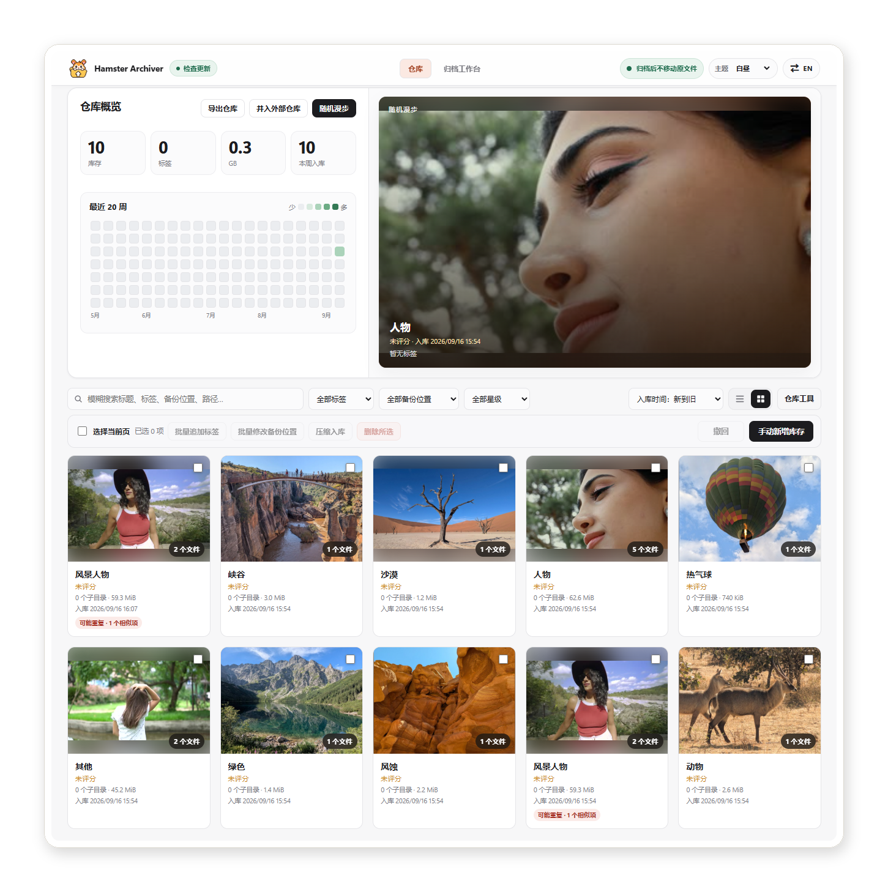
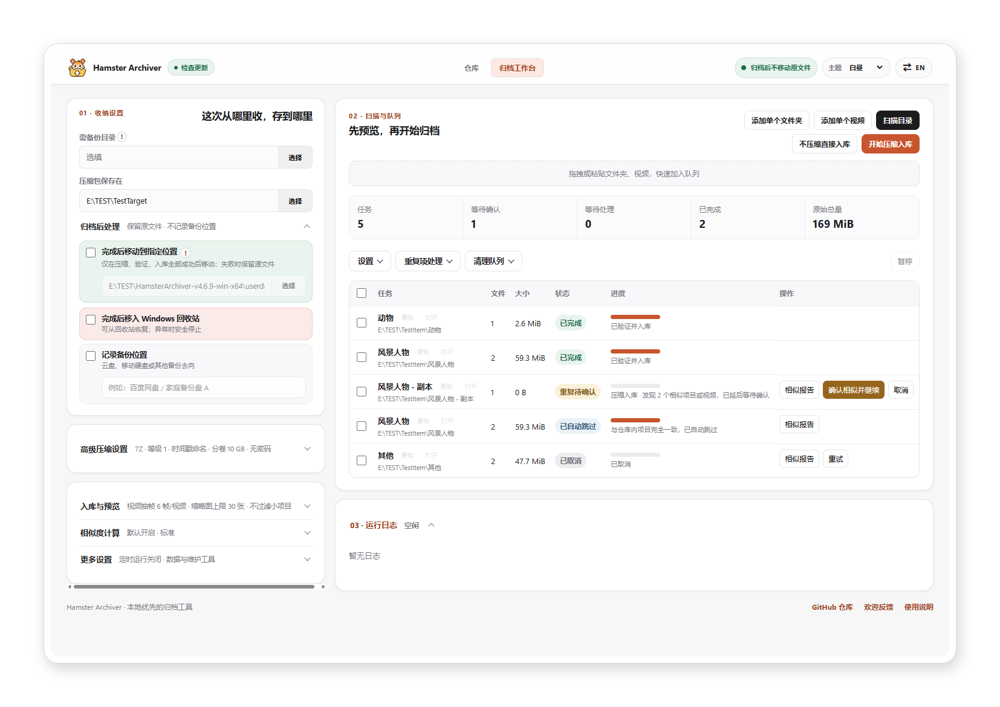
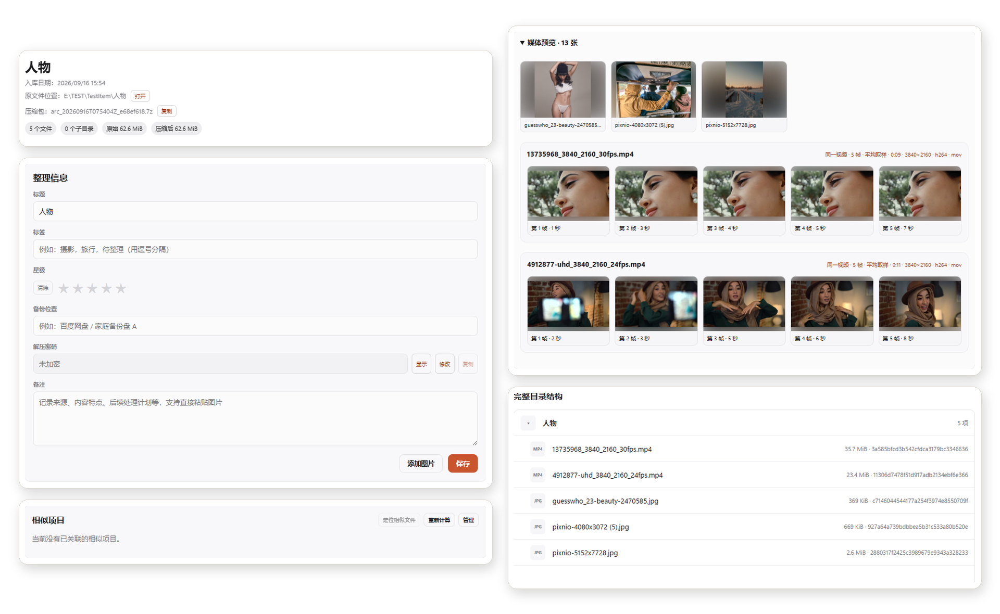
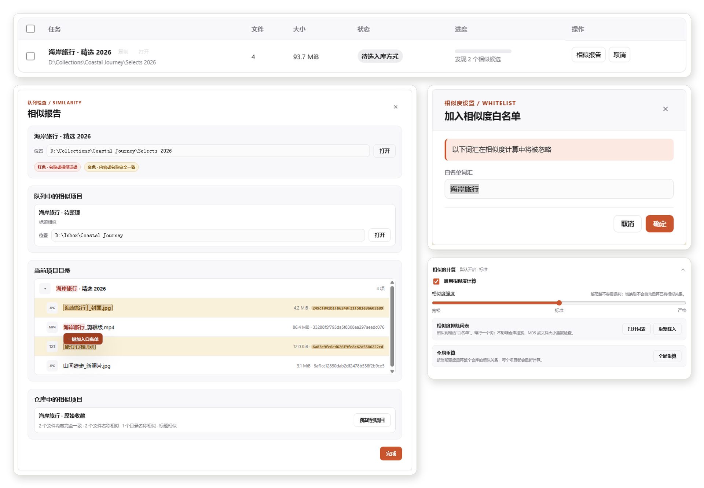

# 仓鼠症大结局 Hamster Archiver

### 收藏的时候很快乐，整理的时候也应该是。

本地资源归档工具，快速为本地文件建立可预览、可搜索、易管理的资源档案。 
记录存放位置与校验信息，随时压缩存储。

**[下载 Windows 正式版](https://github.com/CarlosZ16420/hamster-archiver/releases/latest)** · **[下载 Mac Beta](https://github.com/CarlosZ16420/hamster-archiver/releases/tag/v4.8.6-beta.mac.1)** · [English](README.en.md) · [反馈问题](https://github.com/CarlosZ16420/hamster-archiver/issues)

[快速开始](#快速开始) · [功能介绍](#功能介绍) · [常见问题](#常见问题) · [实验性 AI 接入](#实验性-ai-接入) · [文档与贡献](#文档与贡献)

下载/备份的资源越积越多，硬盘快满了，却一直没整理好？

- 文件夹散落各处，不知道怎么分类，也舍不得随便删。
- 想备份到网盘，又不愿让隐私图片、视频被审核和处理。
- 准备先压缩再上传，却又担心以后只剩一堆看不出内容的压缩包。

**从添加一个资源文件夹开始。** Hamster Archiver 为文件夹和视频建立带封面、预览与目录清单的本地仓库，标签化管理；需要备份时，再批量生成压缩包，按需设置密码和分卷，自动更新本地记录。

**资源可以备份到任何地方，只在本地留下轻量记录，随时看得到内容、找得到位置、留有核对依据。**

### 一座资源仓库，两种整理方式

| 你想做什么 | 怎么用 |
| --- | --- |
| **本地整理：先把电脑里的收藏管起来** | 文件保持原位，为资源生成预览和清单，在仓库里分类、打标签、写备注。以后需要备份，还能把这些项目继续送去压缩。 |
| **打包备份：把资源存储到网盘或其他硬盘** | 批量压缩并核验，记录备份位置；本地保留缩略图与目录，知道每个压缩包装了什么。 |

应用负责打包和记录，存储由你的网盘、硬盘完成；仓库分类不会重排磁盘上的文件夹。

## 快速开始

### Windows

1. 下载 [Windows 正式版](https://github.com/CarlosZ16420/hamster-archiver/releases/latest)：使用 **Setup EXE 安装版**，或完整解压 **ZIP / 7z 便携版**（`HamsterArchiver-v4.8.6-win-x64/`）后运行 `HamsterArchiver.exe`。
2. 在“归档工作台”扫描目录，或拖入文件夹、视频。
3. 想先整理收藏，点击 **“不压缩入库”**；需要打包备份，点击 **“压缩入库”** 并选择保存位置。完成后到“仓库”浏览、分类。

支持 Windows x64，提供中英文界面；压缩和视频预览工具已随发行包提供，无需另装 Node.js。请下载发行包，GitHub 的 Source code 用于源码开发。

ZIP 与 7z 包含相同程序，7z 下载体积更小，需使用支持 7z 的工具解压。每个安装包或压缩包都附有同名 `.sha256` 校验文件，可核对下载是否完整。

扫描主目录时，一级子文件夹和视频会分别作为项目加入；零散文件请先放进文件夹。默认过滤小于 100 MB 的项目，可在“收纳设置”调整或关闭。

### Mac Beta

当前 Mac 版为 **4.8.6-beta.mac.1 测试版**，仍缺乏实际使用测试。请在使用过程中注意文件安全。

支持 macOS 12 及以上，兼容 Apple Silicon 与 Intel。从 [Mac Beta 下载页](https://github.com/CarlosZ16420/hamster-archiver/releases/tag/v4.8.6-beta.mac.1) 下载 **DMG**，打开后将应用拖入“应用程序”；也可下载 **ZIP**，解压后将 `.app` 放到“应用程序”或其他可写目录运行。资料仍保存在用户目录，不随 `.app` 携带。

本 Beta 仅临时签名，未经 Apple 公证。请先核对下载包的 SHA-256；复制完成后，启动所选目录中的应用副本。首次打不开时，请按 [首次启动引导](platforms/macos/README.md#first-launch) 核对提示并操作，指南附有 Apple 官方截图链接；能正常打开时可跳过确认步骤，用户无需申请开发者授权。Mac 版内置 7-Zip，视频抽帧需自行配置 FFmpeg；归档后可保留或移动原文件，不支持自动移入废纸篓及相关恢复。

**请您协助测试：** 先用小型副本验证扫描、归档、更新和恢复，并保留原文件、导出的仓库与独立用户资料备份。如有报错，反馈请附 macOS 版本、Mac 芯片类型、应用版本、操作步骤和错误信息，隐去私人路径及密码。

Mac 会在后台检查新 Beta，**只有你选择版本并确认重启后才会安装**；也可在更新窗口选择本机 DMG / ZIP。手动更新需保留发行文件名，并把同名 `.sha256` 校验文件放在同一目录，目标版本必须高于当前版本。在线回退前请导出仓库并备份用户资料。旧 `4.8.0-beta.mac.2` 不含应用内更新功能，首次升级需手动安装。安装与校验步骤见 [Mac 版指南](platforms/macos/README.md)。

## 功能介绍

### 随时查看完整记录，轻松分类查找管理

记录完整的目录树、缩略图，视频自动抽帧记录（缩略图保存数量可以在设置中调整）。允许备注、标记、修改添加包括图片在内的记录内容。

支持按日期、备注内容、文件名、标签等各种方式模糊检索。标签化管理，一个文件可以交叉备注多个标签。

### 文件夹变了，仓库也能跟上

未压缩的文件夹支持 **“校对更新”**：新增文件自动并入，修改和删除先列出变化，由你选择更新、新建项目或跳过。文件夹搬家后，也可在详情中重新关联原文件位置。

### 相似资源，给出依据再决定

根据文件MD5、文件名等信息计算相似度，对不同相似度的内容分级，加入仓库时自动报告。完整重复的项目可按设置自动跳过；允许手动添加白名单词汇、修改相似判断宽松度。

### 批量打包，按你的备份习惯来

支持 **7z / ZIP、密码和自定义分卷**，可批量排队、暂停或定时运行。处理当前批次时仍能添加下一批资源，视频抽帧和缩略图数量也可调整。

压缩包在最终保存位置通过完整性测试和文件清单核对、登记到仓库后，应用才按你的设置处理原文件；核验失败时保留原文件。

## 常见问题

打包后就能腾出空间吗？

视频和图片不一定能明显压小，生成压缩包还需要额外空间，可以选择另一块硬盘保存。应用只核验本地成品，**不会等待或核实网盘上传**。打算上传后再清理的资源，请先保留原文件，自行确认备份成功；本地成品和回收站文件仍会占用空间。

资源和仓库数据保存在哪里？

不压缩入库时原文件保持原位，仓库保存索引和缩略图；压缩包放在你指定的位置。Windows 便携版默认使用程序旁的 `userdata`，安装版使用 Windows 用户数据目录，卸载默认保留资料；Mac 版使用 `~/Library/Application Support/Hamster Archiver/`。“更多设置”可切换资料位置。

应用自身不上传资源，检查和下载更新会访问 GitHub。

如何更新？仓库导出能备份所有文件吗？

Windows 和 Mac 的后台检查都只发现新版本，不会自动安装；在“检查更新”中选择目标版本，并确认后才开始升级。

- **Windows：** 便携版在线更新优先使用校验后的 7z，缺失时使用同版本 ZIP；手动更新可选择更高版本的 ZIP / 7z，安装版选择 Setup EXE。
- **Mac Beta：** 可在线选择版本并确认重启，或手动选择更高版本的 DMG / ZIP。手动包须保留发行文件名，并与同目录同名 `.sha256` 校验文件配套；详细步骤见 [Mac 版指南](platforms/macos/README.md)。旧 `4.8.0-beta.mac.2` 首次升级仍需手动安装新版。

**仓库导出只包含索引和缩略图，不包含原文件或压缩包**，它们需要单独备份。旧版本没有可用更新入口时，可先导出仓库，再在新程序中“并入外部仓库”，核对后再处理旧目录。

## 实验性 AI 接入

具备本机工具能力的 AI / Agent 可以查询收藏、添加标签、提交入库或压缩任务，例如：“把这个目录不压缩入库，保留原文件。”任务由应用统一校验、排队，并可在归档工作台查看。

AI 正在帮你使用这个项目？请阅读 [AI 快速上手](docs/AI-QUICKSTART.md)。Windows 发行包包含 `hamster.cmd` 和离线指南，Mac Beta 提供应用内 CLI；长期接入可在 **“更多设置 → 实验功能 → AI 助手接入”** 中按需启用。

这是可选的实验功能。AI 客户端会看到工具返回的路径、标题、标签、备注等元数据；Hamster Archiver 本身不会把媒体文件上传到在线模型。可用性取决于客户端、系统和权限。

更多用法：[CLI 参考](docs/CLI.md) · [MCP 参考](docs/MCP.md) · [排错](docs/AI-TROUBLESHOOTING.md)

## 文档与贡献

- [更新日志](CHANGELOG.md)：查看已发布版本的变化与待发布改动。
- [反馈问题或建议](https://github.com/CarlosZ16420/hamster-archiver/issues)：请附版本号、操作步骤和错误信息，隐去私人路径及密码。
- [贡献指南](CONTRIBUTING.md) · [开发指南](docs/DEVELOPMENT.md) · [安全反馈](SECURITY.md) · [MIT License](LICENSE)

Hamster Archiver 原本是我为自己整理收藏写的小工具，希望它能帮你找回收藏和整理的乐趣。感谢 7-Zip、FFmpeg、LinuxDo 社区，以及每一位试用和反馈的朋友。如果它对你有帮助，欢迎点个 Star，或分享你的使用建议。

## 友链

- [LINUX DO](https://linux.do/)
